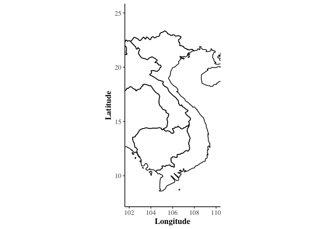
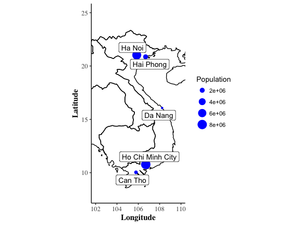
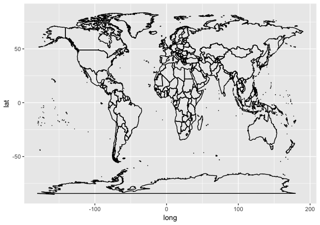
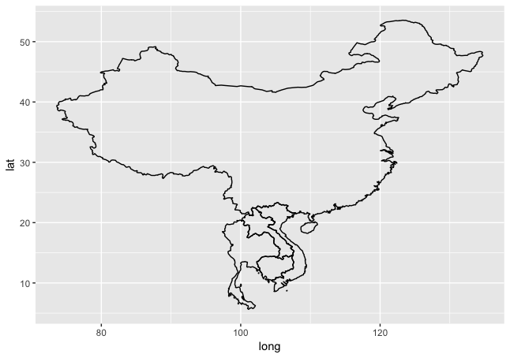
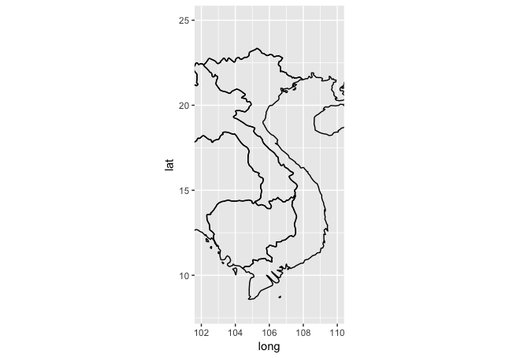
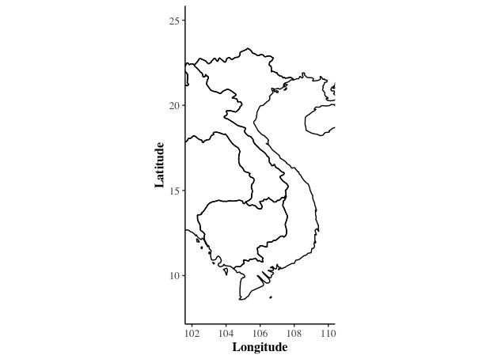
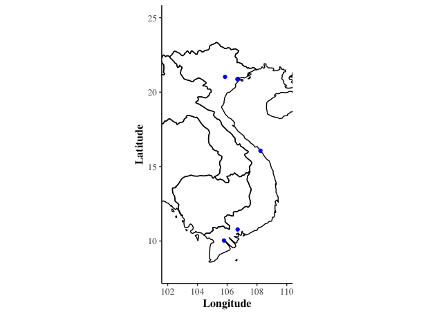
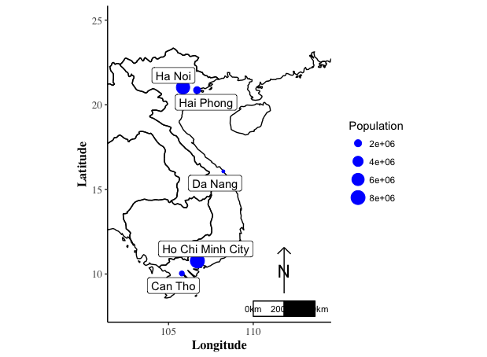

# vMap
A basic plot of Vietnam with R

# Why
A common thing I have to do is make a map for plotting sampling locations on. This map was created for the SEDES IJL workshop to make it more relevant to Vietmanese researchers. This creates a base map of our region of interest. I then demonstrate how to plot points and labels on it.

basemap             |  basemap with cities
:-------------------------:|:-------------------------:
  |  

The following packages are used.

1. ggplot for plotting
2. maps for world map data
3. mapdata to extract data from maps
4. Other packages are included for fiddling with other data types, such as shapefiles

## Blow by blow

  *  Loading needed packages...
  *  Get the map data, and let's take a look at it

world<-map_data("world")

\> head(world)  
       long      lat group order region subregion  
1 -69.89912 12.45200     1     1  Aruba      <NA>  
2 -69.89571 12.42300     1     2  Aruba      <NA>  
3 -69.94219 12.43853     1     3  Aruba      <NA>  
4 -70.00415 12.50049     1     4  Aruba      <NA>  
5 -70.06612 12.54697     1     5  Aruba      <NA>  
6 -70.05088 12.59707     1     6  Aruba      <NA> 

  *  As a dataframe already, it can be quite readily plotted with ggplot

ggplot() +  
   geom_polygon(data = world, aes(x=long, y = lat, group = group), fill = NA, color = "black") 

  

  *  We don't need the whole world, so we can subset the world object to just the neighborhood

vietnam<-subset(world, region %in% c("Vietnam","Cambodia", "Laos", "China", "Thailand"))

  

  * Since we don't need to see all of China and the other countries, I set up a bounding area of reasonable Latitude and Longitude
  
xmin<-102  
xmax<-110  
ymin<-8  
ymax<-25  

Then with coord_fixed we can keep the aspect ration fixed and bound the plot!

ggplot() + 
    geom_polygon(data = vietnam, aes(x=long, y = lat, group = group), fill = NA, color = "black") +  
    coord_fixed(xlim = c(xmin, xmax), ylim = c(ymin, ymax))

  

  * Finally, I'll do a bit of aesthetic changes
  
ggplot() + 
   geom_polygon(data = vietnam, aes(x=long, y = lat, group = group), fill = NA, color = "black") +  
   coord_fixed(xlim = c(xmin, xmax), ylim = c(ymin, ymax)) +   
   xlab("Longitude")+  
   ylab("Latitude")+  
   theme_classic()+  
   theme(axis.text=element_text(size=10, family="Times"),  
         axis.title=element_text(size=12, face="bold", family="Times"))   

  

## How about some physical locations?
I prepared a file with city locations and sizes, read in "bigCities.csv" and then you can use this to plot it:  
  geom_point(data=cities, aes(x=Longitude, y=Latitude), color="blue")+  

  

## Let's try to create this (without looking at the script already made!)

   

I altered geom_point aes() and added geom_label_repel

## Homework

What is missing from this map? I think that it would be very nice to include a scale bar and compass.  Check out either https://github.com/3wen/legendMap or https://github.com/oswaldosantos/ggsn  

You may be able to rather quickly include a legend. Although in my opinion, this example needs some tweaks to become pretty enough to be publishable.

   

